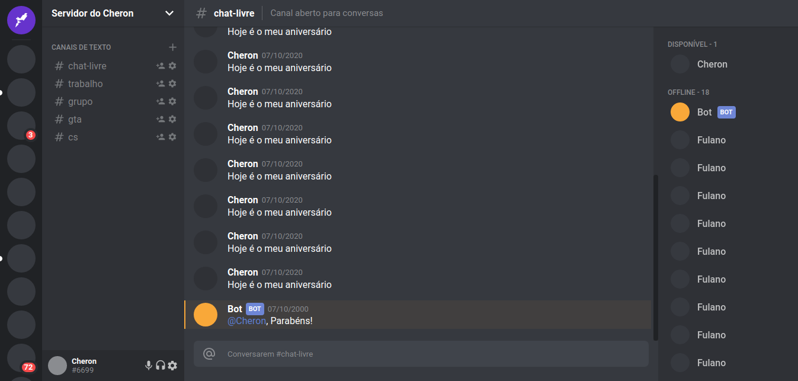

<h1 align="center">Discord UI Clone</h1>

(en-US)
This project is made for study purposes.

(pt-BR)
Esse projeto foi desenvolvido para fins de estudo.

 

  

  

## 🎆 Techs/Tecnologias
(en-US)
This project was developed with the following technologies:

(pt-BR)
Esse projeto foi desenvolvido com as seguintes tecnologias:

- [React](https://reactjs.org)
- [TypeScript](https://www.typescriptlang.org/)

## 🗒 Licença
(en-US)
This project is under the MIT license. See the file [LICENSE](./LICENSE.md) for more details.

(pt-BR)
Esse projeto está sob a licença MIT. Veja o arquivo [LICENSE](./LICENSE.md) para mais detalhes.

---
###### Developed by [João Vitor Cheron](https://www.linkedin.com/in/jo%C3%A3o-vitor-cheron-b810941a2/)
###### Desenvolvido  por [João Vitor Cheron](https://www.linkedin.com/in/jo%C3%A3o-vitor-cheron-b810941a2/)

